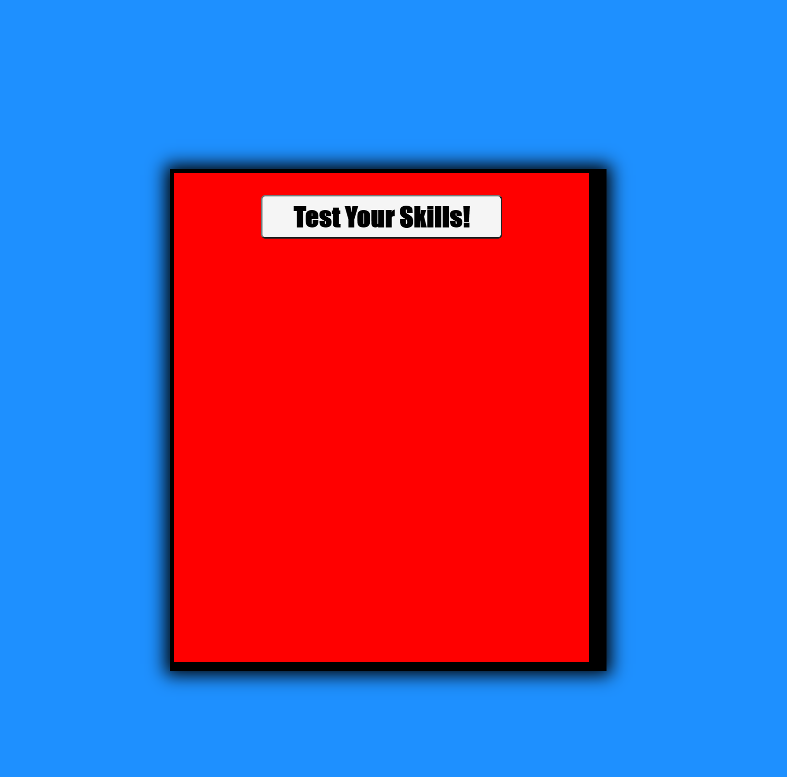

# PopQuiz

Welcome to the Hopelessly-Pointless, PopQuiz! This quiz was designed to be completely random and pointless, so play at your own risk! All the answers were designed to be completely random so good luck!

Quiz consists of 10 random questions, with a timer counting down from 120 seconds. When the timer reaches zero, user should be taken to 'high-score' page. Alternatively, if user completes all 10 questions within alloted amount of time, they will also be taken to 'high-score' page.

References:
https://github.com/SterlingOrth/PopQuiz.git
https://sterlingorth.github.io/PopQuiz/

Sources:
https://www.youtube.com/watch?v=riDzcEQbX6k&amp;t=2s

Screenshot:

<!--
* Timer stop when last question submitted
** Display score and allow place to enter name
*** Create list of questions
**** Subtract Seconds on wrong answer
***** Game ends when timer hits 0-->
